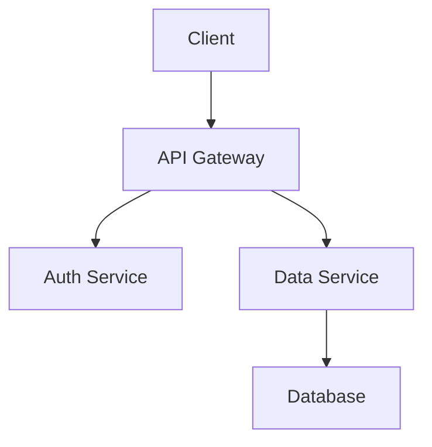

# How to Use the Rebuild README Command

## Quick Start

Run the command with a project path:

```
/rebuild-readme /path/to/project
/rebuild-readme .
/rebuild-readme ~/workspace/my-app
```

## What This Command Does

Analyzes your project and creates `README.md` with:
- Project overview and purpose
- Getting started instructions
- Architecture documentation
- Development workflow
- Deployment process
- API/interface documentation
- Contributing guidelines
- Troubleshooting tips

## When to Use

Run this command when:
- Starting a new project
- Onboarding new team members
- Documentation is outdated
- After major architecture changes
- Before open-sourcing
- Creating project templates
- Migrating projects

## Usage Examples

### Example 1: New Project README

```
User: "/rebuild-readme ."

Command: Analyzing project structure...

Detected:
- Node.js project (package.json found)
- TypeScript (tsconfig.json found)
- React (dependencies include react)
- Jest testing framework

Generating README.md...

✅ README.md created successfully!

Summary:
- Project: My React App
- Tech stack: React, TypeScript, Jest
- Scripts documented: dev, build, test
- 8 sections generated
```

Generated README.md:
```markdown
# My React App

A modern React application built with TypeScript, featuring user authentication and real-time data visualization.

## 🚀 Getting Started

### Prerequisites
- Node.js >= 18.0.0
- npm >= 9.0.0

### Installation
```bash
npm install
```

### Environment Setup
Create a `.env` file with:
```
REACT_APP_API_URL=http://localhost:3000
REACT_APP_AUTH_DOMAIN=auth.example.com
```

### Quick Start
```bash
npm run dev
```

Visit http://localhost:3000

## Architecture

This application follows a component-based architecture with:

### Key Components
- **Authentication** - JWT-based auth with refresh tokens
- **Dashboard** - Real-time metrics visualization
- **API Client** - Axios-based HTTP client with interceptors

### Data Flow
1. User interacts with React components
2. Components dispatch actions
3. API client makes requests
4. State updates trigger re-renders

## Development

### Available Scripts
| Script | Description |
|--------|-------------|
| `npm run dev` | Start development server (port 3000) |
| `npm test` | Run Jest tests with coverage |
| `npm run build` | Build for production |
| `npm run lint` | Run ESLint |
| `npm run format` | Format code with Prettier |

### Testing
```bash
# Run all tests
npm test

# Watch mode
npm test -- --watch

# Coverage report
npm test -- --coverage
```

### Code Style
- ESLint for linting
- Prettier for formatting
- Pre-commit hooks with Husky

## Deployment

### Production Build
```bash
npm run build
```

Outputs to `build/` directory.

### Environments
- **Development**: http://localhost:3000
- **Staging**: https://staging.example.com
- **Production**: https://app.example.com

### CI/CD
Automated via GitHub Actions:
- Tests run on every PR
- Automatic deployment to staging on merge to `develop`
- Manual deployment to production from `main`

## API Documentation

### Authentication Endpoints
- `POST /api/auth/login` - User login
- `POST /api/auth/refresh` - Refresh access token
- `POST /api/auth/logout` - User logout

### User Endpoints
- `GET /api/users/me` - Get current user
- `PUT /api/users/me` - Update current user
- `DELETE /api/users/me` - Delete account

## Contributing

For active development context and current work, see [CONTEXT.md](./CONTEXT.md)

### Development Workflow
1. Create feature branch from `develop`
2. Make changes with tests
3. Run `npm test` and `npm run lint`
4. Submit PR to `develop`

### Code Review Process
- Two approvals required
- All tests must pass
- Coverage must not decrease

## Troubleshooting

### Common Issues

**Issue**: `npm install` fails with permissions error
**Solution**:
```bash
sudo chown -R $(whoami) ~/.npm
npm install
```

**Issue**: Development server won't start
**Solution**:
- Check port 3000 is not in use: `lsof -i:3000`
- Clear node_modules: `rm -rf node_modules && npm install`

**Issue**: Tests fail with module not found
**Solution**:
- Clear Jest cache: `npm test -- --clearCache`

### Logs
- Application logs: `logs/app.log`
- Error logs: `logs/error.log`

### Debug Mode
```bash
DEBUG=* npm run dev
```

## License

MIT License - see LICENSE file for details
```

### Example 2: API Service README

```
User: "/rebuild-readme ~/projects/api-server"

Command: Analyzing API server project...

Detected:
- Node.js/Express API
- PostgreSQL database
- Docker configuration
- Swagger/OpenAPI documentation

Generating professional API README...

✅ README.md created!

Includes:
- API endpoint documentation
- Database schema overview
- Docker setup instructions
- Authentication flow
- Rate limiting details
- Error response formats
```

### Example 3: Library/Package README

```
User: "/rebuild-readme packages/ui-components"

Command: Analyzing component library...

Detected:
- React component library
- Storybook documentation
- TypeScript definitions
- npm package configuration

Generating library README...

✅ README.md created!

Includes:
- Installation instructions
- Component usage examples
- TypeScript prop types
- Storybook link
- Contributing guidelines
- Versioning policy
```

### Example 4: CLI Tool README

```
User: "/rebuild-readme cli-tool/"

Command: Analyzing CLI project...

Detected:
- Command-line tool
- Commander.js for CLI
- Multiple sub-commands
- Configuration file support

Generating CLI tool README...

✅ README.md created!

Includes:
- Installation (global npm install)
- Command reference
- Configuration options
- Usage examples
- Exit codes
- Troubleshooting
```

## Command Workflow

### Step 1: Detect Project Type

```bash
# Check for package.json
test -f package.json

# Check for specific frameworks
grep "react" package.json
grep "express" package.json
grep "next" package.json
```

### Step 2: Analyze Configuration

```bash
# Read package.json scripts
jq '.scripts' package.json

# Check for config files
ls tsconfig.json jest.config.js .env.example
```

### Step 3: Generate Sections

Creates appropriate sections based on project type:
- Web apps: Getting started, development server
- APIs: Endpoint documentation, authentication
- Libraries: Installation, usage examples
- CLI tools: Command reference, config options

### Step 4: Write README.md

Creates professional, well-structured markdown file.

## Best Practices

### Do's ✅

- Run when starting new projects
- Update after major changes
- Include in project templates
- Commit to version control
- Keep examples up to date
- Add badges for build status
- Link to CONTEXT.md for dynamic info

### Don'ts ❌

- Don't include dynamic/changing information
- Don't duplicate CONTEXT.md content
- Don't include sensitive credentials
- Don't make it too long (use docs/ for details)
- Don't forget to update after releases

## Integration with Workflow

### New Project Setup

```bash
# Initialize project
npm init -y

# Set up basic structure
mkdir src tests

# Generate README
/rebuild-readme .

# Review and customize
vim README.md

# Commit
git add README.md
git commit -m "docs: add README"
```

### After Major Refactor

```bash
# Complete refactor
git commit -m "refactor: restructure app architecture"

# Update README to reflect changes
/rebuild-readme .

# Review changes
git diff README.md

# Commit updated docs
git add README.md
git commit -m "docs: update README after refactor"
```

### Before Open-Sourcing

```bash
# Polish codebase
# Add tests
# Update dependencies

# Generate professional README
/rebuild-readme .

# Review for:
# - Clear getting started
# - Contribution guidelines
# - License information
# - Contact/support info

# Publish
```

## Complementary Commands

Use with /rebuild-context for complete documentation:

```bash
# Generate stable documentation
/rebuild-readme .

# Generate dynamic context
/rebuild-context .

# Result:
# README.md - Stable project documentation
# CONTEXT.md - Current development state
```

## Customization Tips

### Add Badges

After generation, add badges to README:

```markdown
# Project Name


[Rest of README...]
```

### Add Visual Diagrams

Include architecture diagrams:

```markdown
## Architecture


```

### Add Screenshots

For UI projects:

```markdown
## Screenshots


```

## Common Questions

**Q: Will it overwrite my existing README?**
A: Yes, it regenerates from scratch. Save custom content first.

**Q: Can I preserve custom sections?**
A: Not automatically. Copy custom sections, regenerate, then re-add.

**Q: How do I customize the output?**
A: Edit the command definition to modify sections/format.

**Q: Does it work for all project types?**
A: Yes, but best for Node.js, Python, and web projects.

**Q: Can I add it to CI?**
A: Not recommended - README shouldn't change automatically.

## Tips for Great READMEs

1. **Clear Purpose** - First sentence explains what project does
2. **Quick Start** - Get user running in < 5 minutes
3. **Visual Examples** - Screenshots, diagrams, code samples
4. **Common Issues** - Document known gotchas
5. **Links** - Reference detailed docs, demos, related projects
6. **Maintenance** - Update when project changes significantly

## Related Commands

- **/rebuild-context** - Generate dynamic development context
- **learn-project** (skill) - Comprehensive codebase analysis

---

Generated by Claude Code Skills Factory
