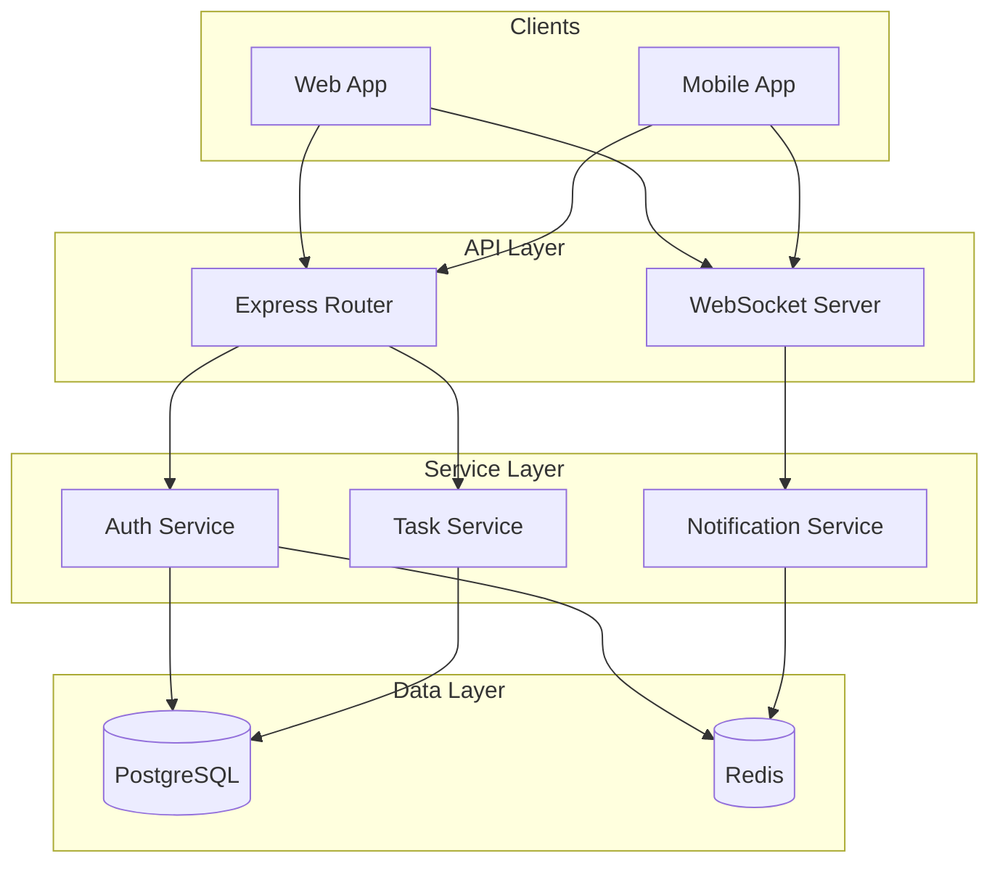

# Example: Portfolio Mode Output

This shows the expected output format for `PROJECT.md`.

---

# TaskFlow API - Project Portfolio

## Elevator Pitch

TaskFlow API is a real-time task management backend serving 500+ daily active users. Built with Node.js and TypeScript, it combines REST endpoints with WebSocket push notifications to enable instant collaboration across web and mobile clients.

---

## Context & Problem

### The Problem
Teams using existing task management tools experienced 30-60 second delays in seeing updates from teammates, leading to duplicate work and miscommunication. Polling-based solutions created unnecessary server load and still couldn't deliver instant updates.

### Domain Context
Enterprise task management for distributed teams. Users expect instant visibility into task changes across devices - similar to real-time collaboration in Google Docs.

### User Needs
- Instant notification when tasks are created, updated, or completed
- Seamless experience across web and mobile
- Reliable authentication that doesn't require frequent re-login
- Fast API responses for task operations

---

## Solution & Approach

### High-Level Solution
A hybrid REST + WebSocket architecture that uses REST for CRUD operations (benefiting from HTTP caching and standard semantics) while pushing real-time updates via WebSocket connections. This provides the best of both worlds: familiar REST patterns for data manipulation with sub-second notification delivery.

### Design Principles
- **Stateless Authentication**: JWT tokens enable horizontal scaling without session storage
- **Separation of Concerns**: Clear boundaries between API, service, and data layers
- **Progressive Enhancement**: Clients work with REST-only if WebSocket unavailable

---

## Technical Implementation

### Architecture

### Technology Stack

| Category | Technology | Purpose |
|----------|------------|---------|
| Runtime | Node.js 20 | High concurrency, non-blocking I/O |
| Language | TypeScript 5 | Type safety, better DX |
| Framework | Express.js | Mature, flexible HTTP framework |
| Database | PostgreSQL | Relational integrity, JSONB flexibility |
| Cache | Redis | Token storage, pub/sub for notifications |
| Testing | Jest + Supertest | Unit and integration coverage |

### Key Design Decisions

#### Decision 1: JWT over Sessions
**Context**: Needed authentication that works seamlessly with mobile clients and future microservices.
**Choice**: Short-lived JWT access tokens (15 min) with longer refresh tokens (7 days).
**Rationale**: Stateless authentication enables horizontal scaling. Short access token expiry mitigates inability to revoke.
**Trade-offs**: Tokens larger than session IDs; can't revoke access tokens before expiry.

#### Decision 2: Hybrid REST + WebSocket
**Context**: REST API existed; needed to add real-time notifications without breaking existing integrations.
**Choice**: Keep REST for CRUD, add WebSocket for push notifications.
**Rationale**: REST benefits (caching, HTTP semantics) preserved while enabling instant updates.
**Trade-offs**: More complex than pure REST; requires clients to manage two connections.

#### Decision 3: PostgreSQL + Redis
**Context**: Tasks have relational structure (users, projects, tags) but need fast caching.
**Choice**: PostgreSQL for persistence, Redis for caching and token storage.
**Rationale**: PostgreSQL handles complex queries with ACID guarantees; Redis provides sub-millisecond reads.
**Trade-offs**: Two databases to manage; eventual consistency between cache and DB.

---

## Key Features

- **JWT Authentication**: Secure, stateless auth with automatic token refresh
- **Task CRUD API**: Full create, read, update, delete with validation
- **Advanced Filtering**: Filter tasks by status, assignee, date range, tags
- **Pagination**: Cursor-based pagination for large task lists
- **Real-time Updates**: WebSocket push notifications within 100ms
- **Rate Limiting**: Prevent abuse with configurable rate limits
- **Request Validation**: Zod-based input validation with clear error messages
- **Comprehensive Logging**: Structured logs with correlation IDs

---

## Outcomes & Metrics

### Quantifiable Results
- **500+ daily active users** across web and mobile clients
- **<100ms notification latency** from task update to client notification
- **99.5% uptime** over 6 months
- **85% test coverage** across unit and integration tests
- **70% reduction in duplicate work** reported by users (compared to polling solution)

### Qualitative Impact
- Enabled real-time collaboration for distributed teams
- Reduced user complaints about stale data to near-zero
- Established patterns reused in two subsequent projects

---

## Technical Challenges & Solutions

### Challenge 1: WebSocket Authentication
**Problem**: JWTs expire while WebSocket connections persist. Needed to re-authenticate without dropping connections.
**Approach**: Implemented token refresh over the WebSocket channel itself.
**Solution**: Clients send refresh token via WebSocket when access token expires; server validates and returns new access token without reconnection.
**Outcome**: Zero-downtime token refresh; connections persist for days without user re-authentication.

### Challenge 2: Database Connection Pool Exhaustion
**Problem**: Under load, database connections were exhausted causing request failures.
**Approach**: Profiled connection usage; found long-running queries holding connections.
**Solution**: Implemented query timeout, optimized slow queries with indexes, added connection pool monitoring.
**Outcome**: Sustained 3x traffic increase without connection issues; p99 latency dropped 40%.

### Challenge 3: Cache Invalidation Consistency
**Problem**: Task updates weren't immediately reflected due to stale cache.
**Approach**: Evaluated cache-aside vs write-through patterns.
**Solution**: Implemented write-through caching with Redis pub/sub for multi-instance invalidation.
**Outcome**: Cache always consistent with database; zero reports of stale data.

---

## Learnings & Growth

### Technical Skills Developed
- **WebSocket Architecture**: First production WebSocket implementation; learned connection management, heartbeats, reconnection strategies
- **PostgreSQL Performance**: Learned query optimization, indexing strategies, EXPLAIN ANALYZE interpretation
- **TypeScript Advanced Types**: Leveraged discriminated unions, template literals for type-safe route handlers

### Insights Gained
- **Start with REST, add WebSocket**: Easier than WebSocket-first; REST remains valuable for CRUD
- **JWT expiry is a feature**: Short expiry forces good refresh patterns, limits breach exposure
- **Cache invalidation is hard**: Write-through with pub/sub better than trying to invalidate on reads

---

## Future Enhancements

- [ ] **Multi-factor Authentication**: Add TOTP/SMS second factor for enterprise users
- [ ] **GraphQL Layer**: Add GraphQL for mobile clients that need flexible queries
- [ ] **Audit Logging**: Track all task changes for compliance requirements
- [ ] **Offline Support**: Queue operations when offline, sync on reconnect

---

## Project Links

- **Repository**: [github.com/example/taskflow-api](https://github.com/example/taskflow-api)
- **API Documentation**: [api.taskflow.example.com/docs](https://api.taskflow.example.com/docs)
- **Live Demo**: [demo.taskflow.example.com](https://demo.taskflow.example.com)

---

## Tags

`Node.js` `TypeScript` `Express` `PostgreSQL` `Redis` `WebSocket` `JWT` `REST API` `Real-time` `Task Management`

---

## Portfolio Use Cases

### Resume Bullet Points
- Built real-time task management API serving 500+ daily users using Node.js, TypeScript, and WebSocket, reducing duplicate work by 70%
- Designed JWT authentication system with automatic refresh, enabling seamless mobile experience across 7-day sessions
- Optimized PostgreSQL queries and implemented write-through caching, improving p99 latency by 40%

### Interview Talking Points
- **Architecture Question**: Discuss hybrid REST+WebSocket decision - why not pure WebSocket or polling
- **Challenge Question**: Use WebSocket authentication refresh as example of solving tricky edge cases
- **Scale Question**: Reference connection pool exhaustion and how monitoring helped identify issues

### LinkedIn Summary
Real-time task management API built with Node.js and TypeScript. Features JWT auth, WebSocket notifications, and PostgreSQL/Redis backend. Serving 500+ daily users with 99.5% uptime.

---

*Generated by codebase-docs skill (portfolio mode) - 2025-11-20*
